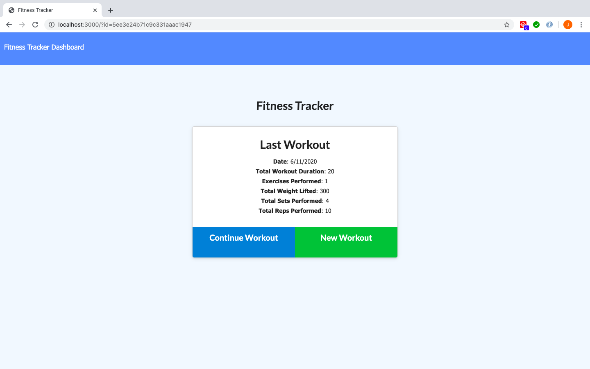
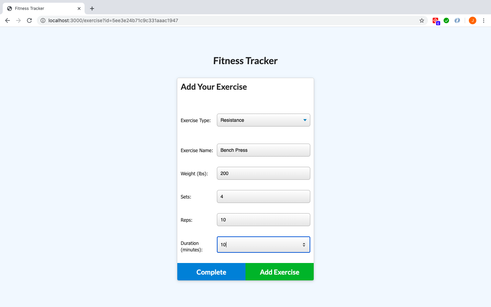
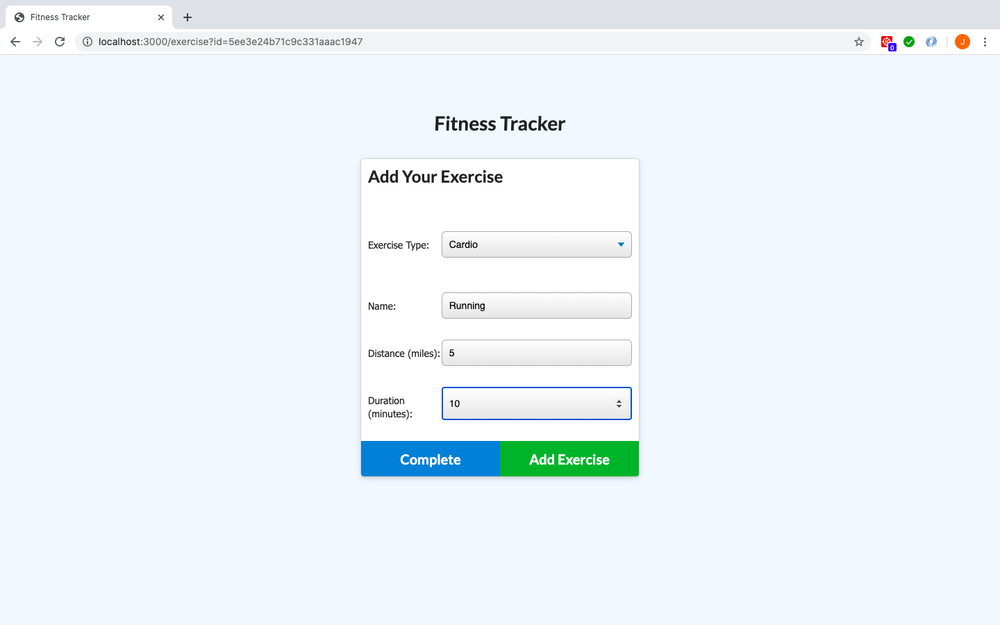
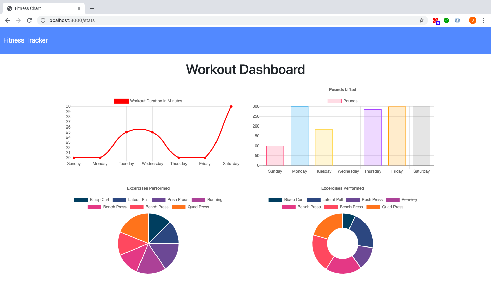

# Workout-Tracker


## Table of Contents

* [Description](#description)
* [Installation](#installation)
* [Usage](#usage)
* [License](#licence)
* [Preview](#preview)
* [Screenshots](#screenshots)
* [Deployed Heroku URL](#Deployed-Heroku-URL)

## Description


## Installation

```
npm i
```

## Usage

```
npm start
```

## Licence

This project is licensed under MIT 

[](https://opensource.org/licenses/MIT)

## Preview


## Screenshots
```
1. MAIN PAGE
```


```
2. RESISTANCE EXERCISE PAGE
```


```
3. CARDIO EXERCISE PAGE
```


```
4. WORKOUT DASHBOARD PAGE
```



## Deployed Heroku URL
https://sheltered-savannah-76251.herokuapp.com/